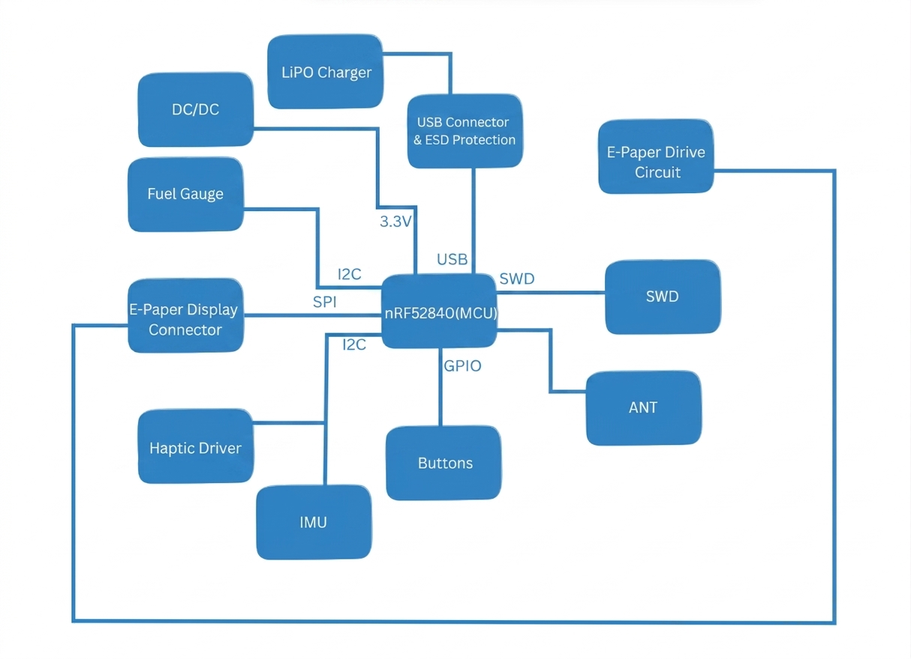
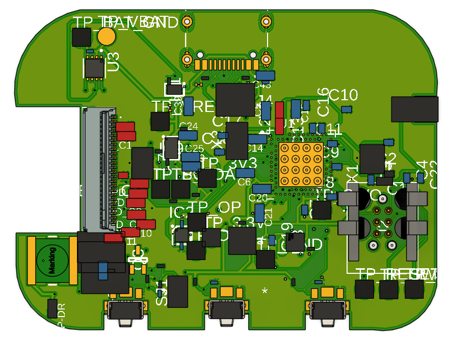

# Proiect InkTime: Smartwatch nRF52840

## 1. Diagrama Bloc

Diagrama de mai jos ilustreaza interconexiunile dintre unitatea centrala (MCU) si perifericele sistemului.

## 2. Descriere Hardware

Ceasul este construit in jurul lui **nRF52840**, ales pentru eficienta energetica ridicata si radio Bluetooth integrat. Principiul fundamental al proiectului: curentul este consumat exclusiv atunci cand este strict necesar.

### 2.1. Unitatea Centrala (MCU)
* **nRF52840:** Microcontroller cu suport nativ pentru Bluetooth 5.0 si USB. Dispune de doua cristale de cuart pentru precizie maxima in masurarea timpului — unul de 32 MHz (HFXO) pentru operatiunile de baza si radio, si unul de 32.768 kHz (LFXO) pentru RTC si modurile de sleep.
* **Antena:** Semnalul radio este directionat catre o antena ceramica **2450AT18B100E** de 2.4 GHz. Pentru a maximiza performanta RF, planul de cupru de sub antena a fost decupat (zona de „keep-out").

### 2.2. Alimentare si Baterie
* **Incarcator (BQ25180YBGR):** Gestioneaza incarcarea bateriei LiPo printr-o conexiune USB-C, inclusiv controlul power path-ului. Comunicarea se face prin **I2C**, permitand monitorizarea starii de incarcare.
* **Fuel Gauge (MAX17048G+T10):** Monitorizeaza cu precizie nivelul de incarcare al bateriei, cu o eroare sub 1%. Poate notifica MCU-ul printr-un pin de alerta atunci cand tensiunea coboara sub un prag configurat.
* **Regulator (RT6160AWSC):** Convertor buck-boost care livreaza un rail stabil de **3.3V** intregului sistem, indiferent de variatiile tensiunii bateriei.
* **Protectie ESD (USBLC6-2SC6Y):** Amplasata direct langa mufa USB-C, atenueaza descarcarile electrostatice pentru a proteja liniile de date ale interfetei.

### 2.3. Display si Feedback Haptic
* **Display E-Paper:** Avantajul principal al acestei tehnologii este ca nu consuma curent decat in momentul actualizarii imaginii. In stare statica, consumul este practic zero.
* **Circuit de driver E-Paper:** Display-ul necesita tensiuni ridicate pentru a misca cerneala electronica. Un circuit dedicat (bobina, diode Schottky si condensatori de 50V) genereaza tensiunile VGH si VGL necesare. Un P-FET (**SI2301CDS**) comanda complet alimentarea display-ului in standby.
* **Driver Haptic (DRV2605LDGSR):** Controleaza motorul ERM (LCM1027B3605F) cu o biblioteca interna de efecte de vibratie, oferind un feedback mai fin si mai variat fata de o simpla comutare cu tranzistor.

### 2.4. Senzori si Butoane
* **Accelerometru (BMA421):** Utilizat pentru numararea pasilor si detectarea miscarii. Conectat pe magistrala **I2C**, pinii sai de intrerupere (INT1, INT2) pot trezi MCU-ul din sleep la ridicarea incheieturii mainii.
* **Butoane (x3 EVP-AKE31A):** Trei butoane tactile SMD pentru navigarea interfetei (sus, jos, enter). Fiecare buton este echipat cu filtre hardware RC pentru eliminarea problemelor de debounce.

## 3. Asociere Pini nRF52840

| Grupa de pini | Pini folositi | Componenta | Justificarea alegerii / Functia |
| :--- | :--- | :--- | :--- |
| **I2C (SDA/SCL)** | **P0.06 / P0.07** | BQ25180, MAX17048, BMA421, DRV2605 | Magistrala I2C comuna; pozitionati departe de zona antenei pentru a evita interferentele RF. Pull-up 10k pe fiecare linie. |
| **Display (SPI)** | **P0.02 (SCK), P0.03 (MOSI)** | Conector FPC E-Paper | Rutare scurta si directa catre conectorul FPC, minimizand lungimea traseelor de mare viteza. |
| **Display Control** | **P0.05 (CS), P0.15, P0.16, P0.17** | Conector FPC E-Paper | Semnale GPIO pentru DC, Reset, Busy. Pinul Busy actioneaza ca intrerupere hardware. |
| **Power Gate Display** | **P1.01** | P-FET SI2301CDS | Comanda tranzistorul de putere care opreste complet alimentarea display-ului in modul standby. |
| **Butoane** | **P0.13, P0.14 / P1.02** | SW1, SW2, SW3 | Buton Enter, Buton Sus (Port 0) si Buton Jos (Port 1). |
| **Alerte & Intreruperi** | **P1.00 – P1.08** | IMU (INT1/INT2), Alerta baterie | Utilizarea portului P1 pentru semnale lente si intreruperi, izolandu-le de magistralele de date rapide. Permite wake-up eficient. |
| **Haptic Enable** | **P0.12** | DRV2605LDGSR | Pin GPIO pentru pornirea/oprirea cipului haptic. |
| **Fuel Gauge Alert** | **P0.10** | MAX17048 | Notificare de la fuel gauge cand tensiunea bateriei scade sub pragul configurat. |
| **Charger Alert** | **P0.11** | BQ25180 | Semnal de alerta de la incarcator pentru potentiale probleme de alimentare. |
| **USB** | **VBUS, D+, D-** | Conector USB-C KH-TYPE-C-16P | Pini hardware dedicati ai PHY-ului intern nRF52840 pentru comunicatie USB nativa. CC1/CC2 cu pull-down 5.1k. |
| **Programare (SWD)** | **SWDIO, SWDCLK, SWO** | Conector Tag-Connect TC2030 | Pini dedicati din fabrica pentru interfata Serial Wire Debug si programare. |
| **Oscilator HF** | **XC1, XC2** | Cristal 32 MHz (2016) | Pini hardware dedicati (HFXO) pentru cristalul extern necesar functionarii MCU si a modulului radio. |
| **Oscilator LF** | **XL1, XL2** | Cristal 32.768 kHz (3215) | Pini hardware dedicati (LFXO) pentru RTC si functiile de Low-Power Sleep. |

## 4. BOM

### Componente Active

| Qty | Componenta | Designator | Cod JLCPCB | Datasheet |
| :--- | :--- | :--- | :--- | :--- |
| 1 | **nRF52840-QIAA-R** (MCU) | U1 | [C190794](https://jlcpcb.com/partdetail/Nordic_Semicon-NRF52840_QIAA_R/C190794) | [Datasheet](https://infocenter.nordicsemi.com/pdf/nRF52840_PS_v1.8.pdf) |
| 1 | **BQ25180YBGR** (Charger) | IC1 | [C3682423](https://jlcpcb.com/partdetail/TexasInstruments-BQ25180YBGR/C3682423) | [Datasheet](https://www.ti.com/lit/ds/symlink/bq25180.pdf) |
| 1 | **RT6160AWSC** (DC/DC) | IC9 | [C7065276](https://jlcpcb.com/partdetail/Richtek_Tech-RT6160AWSC/C7065276) | [Datasheet](https://www.richtek.com/assets/product_file/RT6160A/DS6160A-05.pdf) |
| 1 | **MAX17048G+T10** (Fuel Gauge) | U3 | [C2682616](https://jlcpcb.com/partdetail/AnalogDevices-MAX17048G_T10/C2682616) | [Datasheet](https://www.analog.com/media/en/technical-documentation/data-sheets/MAX17048-MAX17049.pdf) |
| 1 | **BMA421** (Accelerometru) | IC3 | [C5242966](https://jlcpcb.com/partdetail/Bosch_Sensortec-BMA421/C5242966) | [Datasheet](https://www.bosch-sensortec.com/media/boschsensortec/downloads/datasheets/bst-bma421-ds004.pdf) |
| 1 | **DRV2605LDGSR** (Haptic) | IC4 | [C527464](https://jlcpcb.com/partdetail/TexasInstruments-DRV2605LDGSR/C527464) | [Datasheet](https://www.ti.com/lit/ds/symlink/drv2605l.pdf) |
| 1 | **SI2301CDS** (P-FET) | Q1 | [C10487](https://jlcpcb.com/partdetail/Changjiang_Electronics_Tech_CJ-SI2301CDS/C10487) | [Datasheet](https://www.vishay.com/docs/68749/si2301cds.pdf) |
| 1 | **USBLC6-2SC6Y** (ESD) | D3 | [C7519](https://jlcpcb.com/partdetail/Stmicroelectronics-USBLC6_2SC6Y/C7519) | [Datasheet](https://www.st.com/resource/en/datasheet/usblc6-2.pdf) |

### Conectori & Componente Electromecanice

| Qty | Componenta | Designator | Cod JLCPCB | Datasheet |
| :--- | :--- | :--- | :--- | :--- |
| 1 | **Molex 503480-2400** (FPC 24-pin) | J1 | [C2857160](https://jlcpcb.com/partdetail/Molex-5034802400/C2857160) | [Datasheet](https://www.molex.com/en-us/products/part-detail/5034802400) |
| 1 | **KH-TYPE-C-16P** (USB-C) | J4 | [C2765186](https://jlcpcb.com/partdetail/Kinghelm-KH_TYPE_C_16P/C2765186) | [Datasheet](https://datasheet.lcsc.com/lcsc/2012121836_Kinghelm-KH-TYPE-C-16P_C2765186.pdf) |
| 3 | **EVP-AKE31A** (Butoane) | SW1-SW3 | [C2845028](https://jlcpcb.com/partdetail/Panasonic-EVP_AKE31A/C2845028) | [Datasheet](https://industrial.panasonic.com/cdbs/www-data/pdf/ATV0000/ATV0000CE3.pdf) |
| 1 | **TC2030-IDC** (SWD Header) | J_SWD | — | [Datasheet](https://www.tag-connect.com/product/tc2030-idc) |
| 1 | **2450AT18B100E** (Antena 2.4GHz) | ANT1 | [C5179427](https://jlcpcb.com/partdetail/Johanson_Technology-2450AT18B100E/C5179427) | [Datasheet](https://www.johansontechnology.com/datasheets/2450AT18B100/2450AT18B100.pdf) |

### Componente Pasive (selectie)

| Componenta | Valoare | Pachet | Cantitate | Rol |
| :--- | :--- | :--- | :--- | :--- |
| Condensatori EPD | 1uF / 50V | 0402 | 9 | Driver circuit e-paper (VGH/VGL) |
| Condensatori decuplare | 100nF | 0201 | 5 | Decuplare MCU si periferice |
| Condensatori incarcare cristal | 12pF | 0201 | 4 | Load capacitors 32MHz + 32.768kHz |
| Condensatori bulk MCU | 4.7uF | 0402 | 4 | Stabilizare rail 3V3 MCU |
| Condensatori BQ25180 | 1uF | 0402 | 3 | CIN / CSYS / CBAT charger |
| Condensatori RT6160 | 22uF | 0402 | 2 | Intrare convertor buck-boost |
| Condensator USB | 4.7uF | 0402 | 1 | DECUSB nRF52840 |
| Rezistori I2C pull-up | 10k | 0201 | 2 | Pull-up SDA / SCL |
| Rezistori USB CC | 5.1k | 0201 | 2 | Pull-down CC1 / CC2 USB-C |
| Bobina DC/DC nRF | 10uH | 0402 | 1 | Inductor REG1 intern nRF52840 |
| Bobina RT6160 | 0.47uH | 2012 | 1 | Etaj de putere buck-boost |
| Cristal HF | 32 MHz | 2016 | 1 | HFXO — MCU + radio |
| Cristal LF | 32.768 kHz | 3215 | 1 | LFXO — RTC + sleep |

### Componente Asamblate Manual

| Componenta | Descriere | Datasheet |
| :--- | :--- | :--- |
| Display E-Paper | Panou 1.54" 200×200 px, conectat prin FPC 24-pin | [Datasheet](https://www.tme.eu/Document/0ca57a8ffbcd57b5bca53252eb9d6ec3/WSH-12561.pdf) |
| Baterie LiPo | 3.7V / 250mAh, conectata prin fire la test pad-uri | [Datasheet](https://www.tme.eu/Document/b9e12bf26ad0ba929a22ab5d58f022cd/AKY0106.pdf) |
| Motor ERM | Motor vibratii LCM1027B3605F, lipit direct prin fire | [Datasheet](https://www.mouser.com/pdfDocs/ProductOverview_DFRobot-FIT0774.pdf) |
| Carcasa | Prototip imprimat 3D (FDM / SLS) | [Soon™](https://www.youtube.com/watch?v=xm3YgoEiEDc) |

## 5. Decizii de Design

### 5.1. Amplasarea Componentelor pe PCB

Au fost luate urmatoarele decizii strategice pentru a optimiza spatiul, performanta si integritatea semnalului:

* **PCB pe 4 straturi:** Stackup-ul folosit: Top (semnal), GND plane (layer 2), 3V3 plane (layer 3), Bottom (semnal). Aceasta structura ofera o referinta de masa solida pentru traseele de semnal si reduce EMI-ul intern.

* **Planuri de Masa (GND Pours) pe straturi Top si Bottom:** Poligoanele de GND sunt cusute cu via-uri (stitching vias) si servesc trei scopuri:
    1. **Ecranare EMI:** Reduce cuplajul electromagnetic intre traseele de semnal.
    2. **Disipare Termica:** Ajuta la evacuarea caldurii de la convertorul DC/DC si circuitul de incarcare.
    3. **Referinta RF:** Furnizeaza un plan de masa de calitate pentru performanta optima a antenei Bluetooth.

* **Zona RF Keep-out (Antena):** Antena ceramica de 2.4 GHz este pozitionata la extremitatea placii, cu toate straturile de cupru decupate pe sub ea. Grupul de alimentare (charger, fuel gauge, regulator) este plasat la distanta maxima pentru a evita cuplajul cu traseele RF sensibile.

* **Gruparea Circuitului E-Paper:** Componentele aferente display-ului (bobina, diodele si condensatorii de 50V pentru VGH/VGL) sunt concentrate compact imediat langa conectorul FPC. Traseele de inalta tensiune ramane astfel scurte si departe de liniile sensibile ale MCU.

* **Via-in-pad:** Pentru componentele cu footprint mic (WLCSP, DFN), a fost folosita tehnica via-in-pad. Aceasta genereaza cateva avertismente DRC, dar a fost singura solutie viabila pentru rutarea in spatiul disponibil.

* **Conectorul FPC (Display):** Conectorul flex al display-ului a fost curbat in modelul 3D pentru a se potrivi corect in pozitia de asamblare, folosind comanda bend pentru metal sheets din Fusion 360.

### 5.2. Erori Known si Justificari

#### Erori ERC (Electrical Rule Check)
* **Conflicte de alimentare (U1, U3):** Softul semnaleaza erori deoarece mai multi pini `VDD` se conecteaza la aceeasi retea (`3V3` sau `VBAT`). Conexiunile sunt corecte conform datasheet-urilor; eroarea este un fals pozitiv cauzat de restrictiile prea stricte ale tool-ului in legatura cu tipurile de „Power Source".
* **Pinii de decuplare (DEC1, DEC4):** Similar cu cazul anterior, pinii speciali de decuplare ai nRF52840 sunt conectati corect conform recomandarilor producatorului, insa nu sunt recunoscuti ca noduri clasice de alimentare de catre ERC.
* **Componente fara valoare (SJ1):** Jumper-ul SJ1 este un simplu Solder Jumper pentru configurare hardware — un contact de lipit fara valoare numerica, ceea ce este comportamentul asteptat.
* **"Only one pin on net" (SDA/SCL):** Indica trasee lasate fara conexiune la un capat; nu reprezinta o eroare functionala.

#### Erori DRC (Design Rule Check)
Deoarece acest PCB este un *Proof of Concept* si nu este destinat productiei imediate, unele compromisuri de DRC au fost acceptate constient:
* **Board Outline Clearance (8 erori):** Conectorul USB-C si butoanele sunt apropiate de marginea placii prin constrangeri de form factor, declansand automat aceste avertismente.
* **Polygon Overlap (clearance pad-uri):** Placa foloseste componente minuscule (0201/0402) si este extrem de aglomerata. Planul de masa a fost fortat sa acopere cat mai mult spatiu pentru o disipare termica optima, in detrimentul unui raport DRC perfect.
